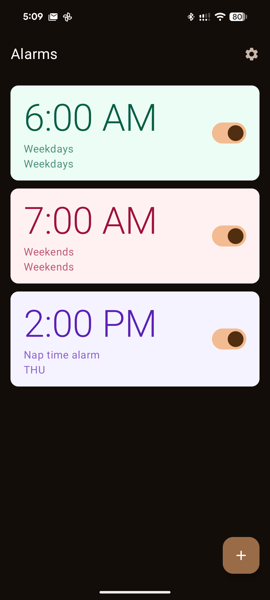
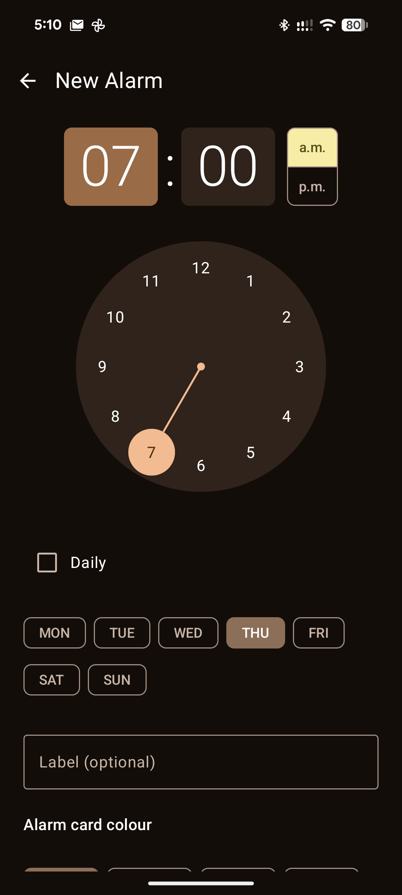
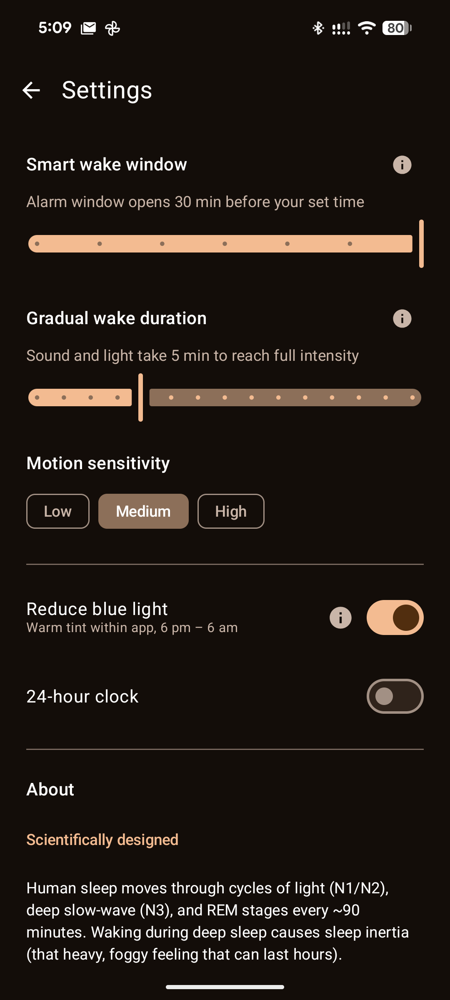
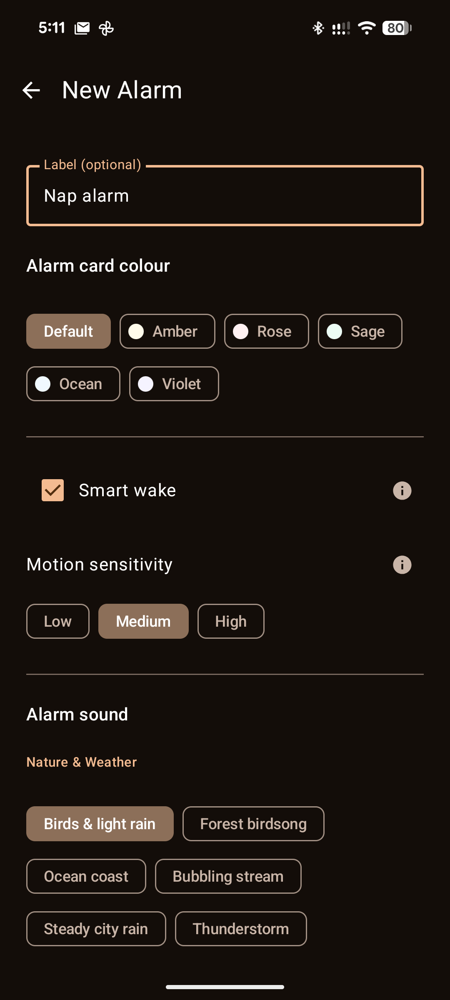
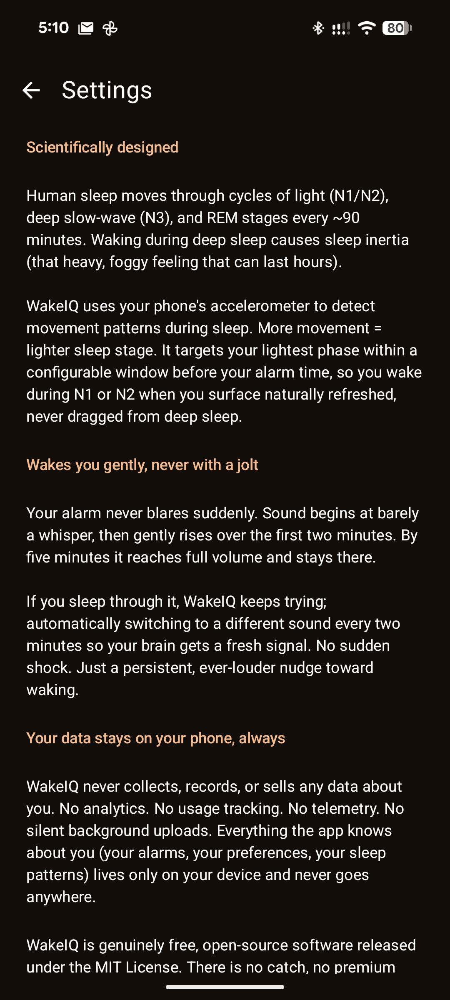

# WakeIQ

A free, open-source Android alarm app that wakes you gently, by working with your sleep cycle instead of against it.


---

## The problem with normal alarms

Every mainstream alarm app fires at a fixed time, at full volume, regardless of what your body is doing. If you happen to be in deep sleep (N3 slow-wave), you get yanked out of it. The result is sleep inertia: cognitive fog, slowed reaction time, and impaired decision-making that can persist for 30 minutes or more, and in some cases for up to four hours.

This is not a minor inconvenience. A University of Colorado Boulder study found that immediately after waking, cognitive performance can be worse than after 24 hours without sleep. The fix is not a louder alarm or more caffeine. It is waking at the right moment in your cycle.

---

## How WakeIQ works

WakeIQ starts the alarm 30 minutes before your set time, beginning at near-silence. Sound rises gradually over your configured ramp duration and reaches full volume by your hard deadline.

The mechanism is passive. Auditory arousal thresholds (the minimum sound intensity required to wake a sleeper) vary dramatically and predictably with sleep stage. In deep NREM (N3), the brain requires significantly louder stimulation to rouse than in light sleep (N1, N2) or REM. As WakeIQ's sound gradually increases:

- While you are in N3, the sound stays below your brain's arousal threshold. You are not disturbed and you do not wake.
- As you naturally cycle into a lighter stage, your threshold drops. The sound, now at a moderate level, is sufficient to rouse you gently.
- You surface gradually rather than being jolted. Your brain has time to transition.

You will always wake by your set time. If you stay in a light stage through the entire window, the sound reaches full volume at your deadline. No sleep stage detection required.

**On sound choice:** A 2020 peer-reviewed study (McFarlane et al., *PLoS ONE*) found that melodic alarm sounds showed a statistically significant relationship to reductions in perceived sleep inertia, while harsh or unmelodic sounds increased it. WakeIQ's bundled sounds are chosen accordingly. Your own familiar, meaningful audio works particularly well.

**On ramp length:** The 5-minute default is a comfort setting. Shorter if you need a more assertive wake. Longer if 5 minutes feels abrupt. Treat it as personal preference, not a clinical parameter.

---

## Features

- Recurring alarms by day of week, or one-shot
- 30-minute smart window before your set time (configurable 0–30 min)
- Gradual sound ramp: configurable 1–15 min, defaults to 5 min
- Screen brightness ramps alongside sound
- Includes natural and melodic alarm sounds across nature, farm, and music categories, chosen for sleep-inertia-reducing properties. Custom audio from device storage also supported.
- Preview the sound options available for alarms
- Motion detection enhancement (Wear OS wrist or phone-on-mattress): optional early trigger if light sleep is confirmed before the ramp start
- Warm colour themes (Amber, Rose, Sage, Ocean, Violet)
- Blue light reduction tint from 6 pm to 6 am
- Snooze support
- Two sensible default alarms on first launch (Weekdays 6:00 am, Weekends 7:00 am), both off until enabled

---

## Screenshots

<table>
  <tr>
    <td></td>
    <td></td>
    <td></td>
    <td></td>
    <td></td>
  </tr>
</table>

---

## Free, open source and private forever.

WakeIQ costs nothing. It has no premium tier, recurring subscriptions or locked features. Everything is available for all users.

**No advertisements, ever.** The app is free and contains zero ads: no banners, interstitials or sponsored content.

Your data never leaves your device. No analytics, telemetry, crash reporting or remote servers. Nothing is transmitted anywhere. Your sleep patterns are yours.

---

## Permissions

| Permission | Why | If denied |
|---|---|---|
| `SCHEDULE_EXACT_ALARM` / `USE_EXACT_ALARM` | Fire at precisely the time you set | Alarm may be late |
| `RECEIVE_BOOT_COMPLETED` | Re-register alarms after restart | Alarms lost on reboot |
| `WAKE_LOCK` | Keep CPU alive with screen off | Alarm may not fire when idle |
| `FOREGROUND_SERVICE` | Run alarm service the OS won't kill | OS may silence the alarm |
| `POST_NOTIFICATIONS` | Show alarm notification | No visible notification |
| `READ_MEDIA_AUDIO` / `READ_EXTERNAL_STORAGE` | Load custom audio files | Cannot use custom sounds |
| `WRITE_SETTINGS` | Control screen brightness | Brightness ramp disabled |
| `HIGH_SAMPLING_RATE_SENSORS` | Wrist/mattress accelerometer for early-trigger detection | Optional detection less precise; ramp still works fully |
| `DISABLE_KEYGUARD` | Show alarm screen over lock screen | Alarm shows behind lock screen |

---

## Building

Requires JDK 17 and Android SDK (compile SDK 35, target SDK 35, min SDK 24 / Android 7.0).

Background execution behaviour changes across that range: exact-alarm scheduling
requires the `SCHEDULE_EXACT_ALARM` permission gate on API 31+, and full-screen
intent delivery requires `USE_FULL_SCREEN_INTENT` on API 34+. See
[ARCHITECTURE.md](ARCHITECTURE.md) for details.

```bash
# Debug APK (full flavour)
./gradlew assembleFullDebug

# Release APKs (full + FOSS)
./gradlew assembleFullRelease assembleFossRelease

# Unit tests
./gradlew testFullDebugUnitTest

# Instrumented tests (requires connected device or emulator)
./gradlew connectedFullDebugAndroidTest

# Lint and style checks
./gradlew ktlintCheck detekt lintFullDebug
```

### Git hooks

Two layers of pre-commit checks run before each commit. Tests and coverage run
in CI, not on commit, to keep the commit loop quick.

`.githooks/pre-commit` runs ktlint, detekt, and unit tests on every commit.
Activate it once per clone:

```bash
git config core.hooksPath .githooks
```

`.pre-commit-config.yaml` adds Android lint (triggered by XML/Gradle changes),
file formatting, and a no-println check. Activate it once per clone (requires
[pre-commit](https://pre-commit.com)):

```bash
pre-commit install
```


---

## Tech stack

| Layer | Technology |
|---|---|
| Language | Kotlin |
| UI | Jetpack Compose + Material 3 |
| Dependency injection | Hilt |
| Database | Room |
| Audio | Media3 / ExoPlayer |
| Async | Coroutines + Flow |
| Build | Gradle 8 (Kotlin DSL) |

---

## Science references

- Williams H.L. et al. (1964). Responses to auditory stimulation, sleep loss and the EEG stages of sleep. *Electroencephalography and Clinical Neurophysiology*, 16, 269–279. [DOI: 10.1016/0013-4694(64)90109-9](https://doi.org/10.1016/0013-4694(64)90109-9)
- Rechtschaffen A., Hauri P., Zeitlin M. (1966). Auditory awakening thresholds in REM and NREM sleep stages. *Perceptual and Motor Skills*, 22(3), 927–942. [DOI: 10.2466/pms.1966.22.3.927](https://doi.org/10.2466/pms.1966.22.3.927)
- Ferrara M. et al. (2000). Auditory arousal thresholds after selective slow-wave sleep deprivation. *Clinical Neurophysiology*, 110(12), 2148–2152. [DOI: 10.1016/S1388-2457(99)00171-6](https://doi.org/10.1016/S1388-2457(99)00171-6)
- McFarlane S.J. et al. (2020). Alarm tones, music and their elements: Analysis of reported waking sounds to counteract sleep inertia. *PLoS ONE*, 15(1), e0215788. [DOI: 10.1371/journal.pone.0215788](https://doi.org/10.1371/journal.pone.0215788)
- McFarlane S.J. et al. (2020). Auditory countermeasures for sleep inertia: Exploring the effect of melody and rhythm in an ecological context. *Frontiers in Neuroscience*. [PMC7445849](https://www.ncbi.nlm.nih.gov/pmc/articles/PMC7445849/)
- Hilditch C.J., McHill A.W. (2019). Sleep inertia: current insights. *Nature and Science of Sleep*, 11, 155–165. [DOI: 10.2147/NSS.S188911](https://doi.org/10.2147/NSS.S188911)
- Vallat R. et al. (2019). Hard to wake up? The cerebral correlates of sleep inertia assessed using combined behavioral, EEG and fMRI measures. *NeuroImage*, 184, 266–278. [DOI: 10.1016/j.neuroimage.2018.09.033](https://doi.org/10.1016/j.neuroimage.2018.09.033)

---

## License

[MIT](LICENSE)
